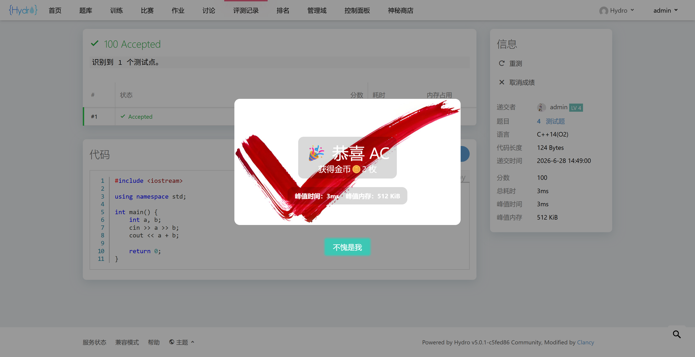

# Hydro AC 弹窗插件

兼容 V5.0.1 社区版，不依赖任何插件和第三方库，安装方法见官方文档。插件特点如下。
1. 弹窗展示背景图、“🎉恭喜 AC” 字样、峰值时间、峰值内存。
2. 如果安装了 `hydro-coin` 插件，并配置了域内首次 AC 奖励，在首次 AC 时会展示掉落金币数量，该插件本身不负责掉落金币。
3. 如果安装了 `hydro-coin` 插件，并上架了弹窗图，在用户兑换并装配后会展示用户专属 AC 图，否则展示默认图。

`/img` 中是 `README.md` 的截图，安装时可以放心删除。

## 部分截图

